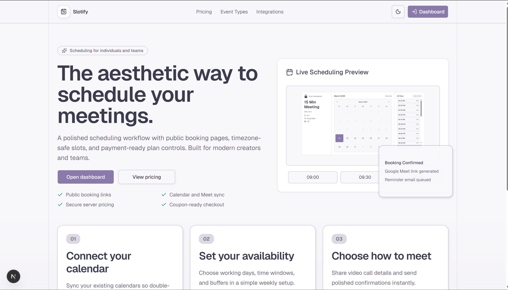

# Slotify

Slotify is a scheduling and booking platform inspired by modern calendar products.

Built with Next.js 16 App Router, React 19, Prisma 7.5, PostgreSQL, Better Auth, Razorpay, and Resend.




## Highlights

- Public scheduling pages with host usernames and event types
- Timezone-aware availability computation with UTC storage
- Booking lifecycle: create, cancel, and reschedule-safe flows
- Google Calendar integration with Google Meet link generation
- Subscription billing with Razorpay orders, verification, and webhook processing
- Booking notifications with Resend and delivery-status webhook sync
- SEO baseline: metadata, structured data, robots, sitemap, and manifest

## Stack

- Framework: Next.js 16, React 19, TypeScript
- Styling: Tailwind CSS v4, Radix/shadcn UI
- ORM/DB: Prisma 7.5 + PostgreSQL
- Auth: Better Auth (Google OAuth)
- Payments: Razorpay
- Email: Resend
- Runtime package manager: Bun

## Local Setup

1. Install dependencies.

```bash
bun install
```

2. Create your env file.

```bash
# Windows (PowerShell)
Copy-Item .env.example .env

# macOS/Linux
cp .env.example .env
```

3. Fill all required environment variables from the table below.

4. Generate Prisma client and run migrations.

```bash
bun run db:generate
bun run db:migrate
```

5. Start the development server.

```bash
bun run dev
```

## Scripts

- `bun run dev` - Start local development server
- `bun run build` - Build production bundle
- `bun run start` - Start production server
- `bun run lint` - Run ESLint
- `bun run db:generate` - Generate Prisma client
- `bun run db:migrate` - Create/apply Prisma migrations in development
- `bun run db:push` - Push schema directly to database (no migration files)
- `bun run db:studio` - Open Prisma Studio

## Environment Variables

The app validates core env vars via `lib/env.ts`. Some integrations are optional at boot and enforced when their features are used.

| Variable | Required | Used By | Notes |
| --- | --- | --- | --- |
| `DATABASE_URL` | Yes | Prisma adapter, migrations | PostgreSQL connection string |
| `GOOGLE_CLIENT_ID` | Yes | Better Auth, Google token refresh | Google OAuth client ID |
| `GOOGLE_CLIENT_SECRET` | Yes | Better Auth, Google token refresh | Google OAuth client secret |
| `BETTER_AUTH_SECRET` | Yes | Better Auth runtime | Strong random secret, min 32 chars recommended |
| `BETTER_AUTH_URL` | Yes | Better Auth runtime | App base URL, example: `http://localhost:3000` |
| `NEXT_PUBLIC_APP_URL` | Recommended | SEO metadata, robots, sitemap | Public canonical base URL |
| `RAZORPAY_KEY_ID` | Required for payments | Razorpay order creation | Needed when using subscription checkout |
| `RAZORPAY_KEY_SECRET` | Required for payments | Razorpay signature verification | Used for verify endpoint and SDK |
| `RAZORPAY_WEBHOOK_SECRET` | Required for Razorpay webhook | Razorpay webhook signature validation | Must match provider webhook secret |
| `RESEND_API_KEY` | Required for booking email | Resend email client | Needed for notification sends |
| `RESEND_FROM_EMAIL` | Required for booking email | Sender identity | Example: `Slotify <noreply@yourdomain.com>` |
| `RESEND_WEBHOOK_SECRET` | Required for Resend webhook | Resend webhook verification | Must match provider webhook secret |

## Webhooks

### Incoming Webhooks

#### Razorpay Subscription Webhook

- Endpoint: `POST /api/subscription/razorpay/webhook`
- File: `app/api/subscription/razorpay/webhook/route.ts`
- Signature header: `x-razorpay-signature`
- Secret used: `RAZORPAY_WEBHOOK_SECRET`
- Events handled:
	- `payment.captured`
	- `order.paid`
	- `payment.failed`
- Behavior:
	- Validates signature against raw body
	- Uses transaction + `SELECT ... FOR UPDATE` lock on `SubscriptionOrder`
	- Idempotent processing for already paid orders
	- Activates user subscription and records coupon redemption safely

#### Resend Delivery Webhook

- Endpoint: `POST /api/webhooks/resend`
- File: `app/api/webhooks/resend/route.ts`
- Required headers:
	- `svix-id`
	- `svix-timestamp`
	- `svix-signature`
- Secret used: `RESEND_WEBHOOK_SECRET`
- Events handled:
	- `email.sent`
	- `email.delivered`
	- `email.failed`
	- `email.bounced`
	- `email.complained`
	- `email.suppressed`
- Behavior:
	- Verifies webhook signature
	- Resolves notification log by `notification_log_id` tag
	- Updates `NotificationLog` status and failure metadata

### Provider Dashboard Configuration

#### Razorpay

1. Create webhook pointing to `https://<your-domain>/api/subscription/razorpay/webhook`.
2. Subscribe to the payment events listed above.
3. Copy webhook secret into `RAZORPAY_WEBHOOK_SECRET`.

#### Resend

1. Create webhook pointing to `https://<your-domain>/api/webhooks/resend`.
2. Enable email lifecycle events listed above.
3. Copy webhook secret into `RESEND_WEBHOOK_SECRET`.

## API Surface

| Method | Route | Purpose |
| --- | --- | --- |
| `GET/POST` | `/api/auth/[...all]` | Better Auth handlers |
| `GET` | `/api/availability` | Availability slots for host/event type/date window |
| `GET/POST` | `/api/bookings` | Host bookings list and booking creation |
| `PATCH/DELETE` | `/api/bookings/[bookingId]` | Update/cancel booking |
| `POST` | `/api/bookings/public/[bookingId]/cancel` | Public cancel flow |
| `GET/POST` | `/api/event-types` | List/create event types |
| `GET/PATCH/DELETE` | `/api/event-types/[slug]` | Event type by slug |
| `POST` | `/api/onboarding/complete` | Finish onboarding |
| `GET` | `/api/pricing` | Public plans and active coupons |
| `POST` | `/api/subscription/razorpay/order` | Create Razorpay order |
| `POST` | `/api/subscription/razorpay/verify` | Verify payment signature |
| `POST` | `/api/subscription/razorpay/webhook` | Razorpay webhook |
| `POST` | `/api/webhooks/resend` | Resend webhook |

## SEO Setup Included

- Global metadata: `app/layout.tsx`
- Home metadata + JSON-LD: `app/page.tsx`
- Robots: `app/robots.ts`
- Sitemap: `app/sitemap.ts`
- Manifest: `app/manifest.ts`

Make sure `NEXT_PUBLIC_APP_URL` points to your production domain for correct canonical links and sitemap host.

## Architecture Notes

- Time handling:
	- Persist all date-time values in UTC.
	- Compute availability in host timezone, render in attendee timezone.
- Concurrency:
	- Booking creation relies on DB-level uniqueness and conflict handling.
	- Payment webhooks and payment verification use transaction row locks for idempotency.
- Integrations:
	- Google account reconnection flows are handled when token refresh fails.
	- Email sending degrades gracefully when Resend env vars are missing.

## Production Checklist

1. Set all required env vars in deployment platform.
2. Configure Google OAuth redirect URIs and consent screen.
3. Configure Razorpay webhook and verify signature behavior.
4. Configure Resend domain, sender, and webhook.
5. Run migrations in production database.
6. Set `NEXT_PUBLIC_APP_URL` to the live HTTPS domain.
7. Verify `/robots.txt`, `/sitemap.xml`, and `/manifest.webmanifest`.

